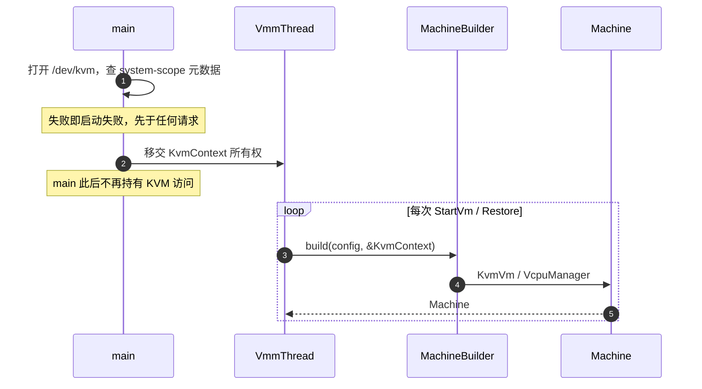

# KvmContext 设计

[vmm-architecture.md](vmm-architecture.md) 把 `KvmContext` 标为 `[process scope]`，但没有说清这个 scope 凭什么成立、哪些东西不该进来。本文补齐四件事：scope 的依据、能力查询的归属、所有权与构造时机、被否掉的替代方案。涉及 `KvmContext` 的 scope 问题以本文为准。

## 结论

- 一个 KVM 设备 fd（默认 `/dev/kvm`）及其 **system-scope 不可变元数据**，进程内一份，启动早期打开，活到进程结束。
- **VM-scope 的能力查询不属于这里**，归 `KvmVm`。类型名应带 scope。
- 设备路径可由用户指定，但是**进程级参数**：不进 `MachineConfig`，不进快照。
- process scope 指所有权与生命周期，**不是 global**：显式参数传递，不用 `static` / `OnceCell`。
- 对外暴露纯数据投影 `HostCapabilities`，`validate` 与 restore 校验只依赖投影，不依赖 fd。

## 为什么是 process scope

省几次 ioctl 不是理由。每台 VM 重查一遍 `KVM_GET_SUPPORTED_CPUID` 完全负担得起，单凭性能撑不起一个独立层次。真正的依据是三条：

1. **特权窗口**。`/dev/kvm` 必须在进程收缩权限之前打开。本项目目前没有 jailer 与 seccomp，但一旦按 Firecracker 路线引入，"第一次 `StartVm` 时才打开"就是错的 —— 那时进程可能已经没有 `/dev` 访问权，而这个决定无法事后回退。打开时机因此是架构约束，不是实现细节。
2. **`validate` 要是纯函数**。[blog 04](blog/04-reducer-and-effects.md) 要求状态机测试不需要 `/dev/kvm`，而 `validate(config, caps)` 收的是 `&HostCapabilities`。把宿主能力在打开 fd 时一次性快照成纯数据，验证与快照恢复校验才能是可测的纯函数。这才是"查一次"的意义所在。
3. **跨 machine 生命周期**。`machine: Option<Machine>` 意味着一个进程内可能经历 stop、restore、再建。宿主能力不随 machine 生灭，它的生命周期与进程对齐而不是与 VM 对齐。

## ioctl 的 scope 决定类型的 scope

KVM 的能力查询有 system、VM、vCPU 三个 scope。规则是：**查询放在它所用 fd 对应的那一层**，不因为"启动时查一次更方便"而上移。

| 查询                                                  | fd         | 归属         |
| ----------------------------------------------------- | ---------- | ------------ |
| `KVM_CHECK_EXTENSION`                                 | `/dev/kvm` | `KvmContext` |
| `KVM_GET_SUPPORTED_CPUID`                             | `/dev/kvm` | `KvmContext` |
| `KVM_GET_MSR_INDEX_LIST`                              | `/dev/kvm` | `KvmContext` |
| `KVM_GET_MSR_FEATURE_INDEX_LIST` + `KVM_GET_MSRS`     | `/dev/kvm` | `KvmContext` |
| `KVM_GET_VCPU_MMAP_SIZE`                              | `/dev/kvm` | `KvmContext` |
| `KVM_CHECK_EXTENSION`（`KVM_CAP_CHECK_EXTENSION_VM`） | vm fd      | `KvmVm`      |
| `KVM_ARM_PREFERRED_TARGET`                            | vm fd      | `KvmVm`      |
| `KVM_MEMORY_ENCRYPT_OP` 的能力子命令（TDX/SEV）       | vm fd      | `KvmVm`      |

第二组是这里最容易做错的地方。内核文档明确写了：不同初始化方式的 VM 能力可以不同，鼓励在 vm fd 上查询能力（这正是 `KVM_CAP_CHECK_EXTENSION_VM` 存在的原因）。`KVM_CREATE_VM` 的 machine type 参数（arm64 用它编码 IPA size）本身就说明 VM 的能力集依赖创建参数。

把一个笼统的 `KvmCapabilities` 放在进程层，结果只有两种：在错误的 scope 上问出错误答案，或者将来在 `KvmVm` 上再加一个能力结构，于是"支持不支持 X"有两个都对不上的权威答案。所以进程层的能力集合只装 system-scope 的回答。

`KvmCapabilities` 只容纳 `KVM_CHECK_EXTENSION` 的布尔结果，不放索引列表和数值，否则"是否支持某能力"与"某 MSR 值是多少"会共用一个类型。

## 三个能力类型的关系

文档里出现过三个名字，关系必须固定下来：

```rust
struct KvmContext {
    kvm: Kvm,                         // /dev/kvm
    capabilities: KvmCapabilities,    // KVM_CHECK_EXTENSION，system scope，布尔集
    supported_cpuid: CpuId,           // KVM_GET_SUPPORTED_CPUID
    msr_index_list: MsrIndexList,     // KVM_GET_MSR_INDEX_LIST
    msr_features: MsrFeatureList,     // KVM_GET_MSR_FEATURE_INDEX_LIST + KVM_GET_MSRS
}

impl KvmContext {
    /// 纯数据投影：无 fd、可构造、可序列化。
    fn host_capabilities(&self) -> HostCapabilities;
}

fn validate(config: MachineConfig, caps: &HostCapabilities) -> Result<ValidatedMachineConfig>;
```

- `KvmContext` 持有 fd，是唯一与内核交互的一层。
- `HostCapabilities` 是它的纯数据投影，`validate` 与 CPU template 的输入。测试直接构造它，不需要 `/dev/kvm`。
- `SnapshotManifest.required_capabilities: CapabilitySet` 是快照对宿主的**断言集**，与 `HostCapabilities` 同一套词汇：恢复时的校验就是"目标宿主的 `HostCapabilities` 是否覆盖 manifest 的 `CapabilitySet`"。`VcpuState` 保存的 MSR 索引集合属于这里，验证阶段判定，不留给 `KVM_SET_MSRS` 失败。

一个方向性约束：`KvmContext` 依赖 `HostCapabilities`，反过来不成立。纯数据一侧不得引用 fd、`Kvm` 或任何 kvm-ioctls 类型。

## process scope 不等于 global

`[process scope]` 描述的是生命周期，不是可见性。真正的不变量是"来自 `/dev/kvm` 的 system-scope 查询，在该 fd 生命周期内不变"。这个标签最容易导致的退化是变成 `static OnceCell<KvmContext>`，那样第 2 条理由（可测试的纯函数）当场失效，还会让任何需要替身的测试都不得不摸真实 `/dev/kvm`。

因此：`KvmContext` 始终作为显式参数传递；`MachineBuilder` 收 `&KvmContext`；能力相关的判断尽量写成对 `HostCapabilities` 的判断。

## 所有权与 Arc



- **谁打开**：main 在启动期打开并校验。`/dev/kvm` fd 是宿主能力句柄，不是 VM 内部状态，不违反"main 不承担 VM 内部状态"这条职责划分。移交之后 main 侧不再保留副本。
- **`Arc` 的条件**：只有当 `Machine` 构造完成后仍有组件需要这个 fd 时才成立。按 kvm-ioctls 0.25 的实际实现，这样的消费者一个都没有：`create_vm` 内部已经取了 `KVM_GET_VCPU_MMAP_SIZE` 并存进 `VmFd`，`create_vcpu` 只用 vm fd，vCPU 线程拿到的是 `VcpuFd`。所以默认结论是**不要 `Arc`**：`run_vmm` 按值持有，向 builder 传 `&KvmContext`；等出现真正的构造期外消费者再改。
- **架构树的那条边**：`run_vmm(requests, kvm: Arc<KvmContext>)` 是跨组件共享，架构树里 `KvmContext` 与 `VmmThread` 之间应有 `Arc ->` 边；目前的树把两者画成无关的兄弟节点，与签名不一致。

## 设备路径由用户指定

默认 `/dev/kvm`，允许用户覆盖（容器内 bind-mount 到非常规位置、测试宿主把改过的 kvm 模块挂在另一个设备节点上）。这个参数属于**进程级**（CLI），不属于 `MachineConfig`：

1. **时序**。fd 要在权限收缩前打开，路径因此必须比第一个请求更早知道。放进请求参数就直接与特权窗口矛盾。
2. **快照纯净**。`MachineConfig` 经 `MachineModel` 进快照，路径进了 config 就会被序列化；一个宿主本地路径对另一台宿主没有意义，也违反快照"不依赖可变文件路径"这条规则。
3. **攻击面**。允许 API 调用方指定路径，等于让它驱使 VMM 对任意字符设备发 ioctl；而 argv 的控制者本来就控制这个进程，放在 CLI 不扩大权限。

一旦路径可变，打开时的校验就不再是形式主义。kvm-ioctls 只管打开，下面这几项必须自己做：

- **API 版本必验**。kvm-ioctls 0.25 的 `Kvm::new()` 与 `new_with_path()` 都不查 `KVM_GET_API_VERSION`，只是 `open` 后 `from_raw_fd`。内核文档要求返回值不等于 12 就应当报错退出。默认路径下这条可有可无，路径可变之后它是唯一能确认"这真是 KVM"的检查。
- **必须是字符设备**。`fstat` 先判 `S_IFCHR`。普通文件也能 `O_RDWR` 打开成功，不先判就只能等 ioctl 报 `ENOTTY`，错误信息不说人话。不检查 major 号：KVM 是 misc 设备，minor 动态分配，硬编码 major 10 会挡死非常规环境。
- **`CString` 转换**。`Kvm::new_with_path` 收 `AsRef<CStr>` 而不是 `Path`，路径内嵌 NUL 要当参数错误报出来，不是 `unwrap`。
- **保留 O_CLOEXEC**。`open_with_cloexec_at(path, true)` 已经给了；进程会 exec vhost-user backend，泄露 kvm fd 是权限泄露。唯一例外是将来 jailer 的 pre-open + exec 交接，那是父进程显式选 `close_on_exec = false`。
- **错误与日志带上路径**。路径写错是这个选项最常见的误用，`ENOENT` / `EACCES` 必须指名道姓；启动日志记生效路径与 `st_rdev` 的 major:minor，一眼能看出到底用了哪个设备。

路径存在 `KvmContext` 里只为日志和错误信息服务，**不进** `HostCapabilities`、`MachineModel` 和 `CapabilitySet`——它不是一项能力。直接后果是：用非默认路径做的快照，只要能力覆盖成立，就能在默认路径的宿主上恢复。

落地位置：`Cli` 增一个 `--kvm-dev <PATH>`（`default_value = "/dev/kvm"`，现有的 `cli = {cli:?}` 启动日志自动带上生效值）与 `CliOps::kvm_dev()`，main 打开成 `KvmContext` 后传给 `vmm::start`。它与 `--api-sock` 同级，不进任何请求类型。将来若要支持 jailer 递预先打开的 fd，对应 `--kvm-fd <N>`，内部类型留成 `Path | Fd` 两支，不把签名写死成 `PathBuf`。

## supported_cpuid 是只读基线

缓存的 `supported_cpuid` 是宿主基线，不是某台 VM 的 CPUID。CPU template 要改写 entry，因此每台 VM 使用的是它的 clone；共享在 `Arc` 后面的那份永不修改。两类 MSR 元数据同理，进程层只保存"内核报了什么"，不保存"这台 VM 用了什么"。

## 被否掉的替代方案

| 方案                        | 好处                                  | 否掉的原因                                                       |
| --------------------------- | ------------------------------------- | ---------------------------------------------------------------- |
| 每台 VM 打开一次 `/dev/kvm` | 内核模块重载后能刷新元数据            | 与收缩权限的时序冲突；刷新场景在 VMM 生命周期内不存在            |
| `static` / `OnceCell` 全局  | 少传一个参数                          | 纯函数验证与测试注入全部失效                                     |
| 首次 `StartVm` 时懒打开     | 缺 `/dev/kvm` 时可返回结构化 API 错误 | fail-late，且与特权窗口冲突。缺 KVM 应报成启动失败，而不是 panic |

## 现状

`KvmContext` 尚未落地。KVM 侧原语已随 POC 一并移除，`crates/vmm` 目前只有控制面骨架与设备模型。本文与 [vmm-architecture.md](vmm-architecture.md) 一样描述目标边界，等 KVM 侧重写时按此实现。
