# VMM 目标架构

本文只记录主要结构、所有权和线程边界，具体接口后续展开。

## 架构树

图例：`├─` 表示所有权，`Arc ->` 表示跨组件共享，`channel ->` 表示消息边界。

```text
DragonballProcess
│
├─ KvmContext                                      [process scope]
│  ├─ Kvm (/dev/kvm)
│  ├─ KvmCapabilities
│  └─ supported CPUID / MSR metadata
│
├─ MainRuntime                                     [main thread]
│  ├─ CLI / API / TUI
│  ├─ signal handlers
│  └─ VmmClient
│     └─ channel -> VmmServer
│
├─ VmmThread                                       [vmm-main + LocalRuntime]
│  └─ run_vmm() stack frame
│     ├─ requests: VmmServer
│     ├─ pending replies / operation ids
│     ├─ exit status
│     └─ machine: Option<Machine>
│        │
│        ├─ MachineModel                              [pure data]
│        │  ├─ MachineState
│        │  ├─ validated config / topology
│        │  └─ stable resource layout
│        │
│        ├─ Arc<MachineMemory>                       [runtime]
│        │  ├─ RAM regions
│        │  │  └─ anonymous / memfd / hugetlb backing
│        │  ├─ DeviceMemoryRegions
│        │  │  └─ DaxWindow / virtio shared-memory region
│        │  └─ KvmSlotAllocator
│        │
│        ├─ Arc<KvmVm>
│        │  ├─ VmFd
│        │  ├─ irqchip / PIT
│        │  └─ Arc -> MachineMemory
│        │
│        ├─ Arc<AddressSpace>
│        │  ├─ PioBus
│        │  └─ MmioBus
│        │     └─ Arc<Mutex<Transport / PciFunction>>
│        │
│        ├─ InterruptManager
│        │  ├─ GsiAllocator
│        │  ├─ IRQ routing
│        │  └─ irqfd / resamplefd registrations
│        │
│        ├─ VcpuManager
│        │  ├─ VcpuHandle[0..N]
│        │  └─ channel <- VcpuExit
│        │
│        ├─ DeviceManager
│        │  ├─ ResourceManager
│        │  ├─ LocalTaskSet
│        │  └─ AttachedDevice[]
│        │     ├─ EmulatedVirtio
│        │     │  ├─ shared Transport
│        │     │  └─ local async Backend task
│        │     ├─ VhostUserDevice
│        │     │  ├─ shared Transport
│        │     │  ├─ control task
│        │     │  └─ kickfd / callfd
│        │     └─ VfioDevice
│        │        ├─ shared PciFunction
│        │        ├─ DMA domain
│        │        └─ BAR / interrupt resources
│        │
│        └─ MachineEvents
│
├─ VcpuThread[0..N]                                [OS threads]
│  └─ VcpuRunner
│     ├─ VcpuFd + blocking KVM_RUN
│     ├─ Arc -> AddressSpace
│     └─ channel -> MachineEvents
│
├─ VhostUserBackend                                [external process]
│  ├─ control socket
│  ├─ exported RAM fds
│  └─ virtqueue data path
│
└─ Kernel / Hardware
   ├─ KVM memory slots / irqchip
   ├─ ioeventfd / irqfd
   ├─ VFIO / IOMMU / iommufd
   └─ physical device DMA / interrupts
```

| 执行位置           | 主要职责                                        | 不应承担                |
| ------------------ | ----------------------------------------------- | ----------------------- |
| main               | CLI、API、TUI、信号处理                         | VM 内部状态和设备数据面 |
| vmm-main           | 生命周期、请求分发、异步设备、vhost-user 控制面 | 阻塞 `KVM_RUN`          |
| vcpu-N             | `KVM_RUN`、同步 MMIO/PIO exit                   | 异步设备 I/O            |
| vhost-user process | 外部 virtqueue 数据面                           | VM 全局生命周期         |
| kernel/hardware    | irqfd、ioeventfd、VFIO DMA/中断                 | userspace 策略          |

## 核心数据结构

```rust
struct KvmContext {
    kvm: Kvm,
    capabilities: KvmCapabilities,
    supported_cpuid: CpuId,
    msr_index_list: MsrIndexList,     // KVM_GET_MSR_INDEX_LIST
    msr_features: MsrFeatureList,     // KVM_GET_MSR_FEATURE_INDEX_LIST + KVM_GET_MSRS
}

async fn run_vmm(mut requests: VmmServer, kvm: Arc<KvmContext>) -> VmmExitStatus {
    let mut machine: Option<Machine> = None;
    let mut pending = HashMap::<OperationId, PendingReply>::new();

    let exit_status = loop {
        let input = next_loop_input(&mut requests, machine.as_mut()).await;
        let control = match input {
            LoopInput::Request(request) => {
                dispatch_request(request, &kvm, &mut machine, &mut pending).await
            }
            LoopInput::MachineEvent(event) => {
                drive_transition(event, &mut machine, &mut pending)
            }
            LoopInput::Exit(status) => LoopControl::Exit(status),
        };

        if let LoopControl::Exit(status) = control {
            break status;
        }
    };

    teardown(machine).await;
    exit_status
}

struct Machine {
    model: MachineModel,
    memory: Arc<MachineMemory>,
    vm: Arc<KvmVm>,
    vcpus: VcpuManager,
    address_space: Arc<AddressSpace>,
    interrupts: InterruptManager,
    devices: DeviceManager,
    events: MachineEvents,
}

struct MachineModel {
    state: MachineState,
    config: ValidatedMachineConfig,
    topology: DeviceTopology,
    resources: ResourceLayout,
}
```

- `KvmContext`：宿主能力与 VM 工厂。CPUID 与两类 MSR 元数据都是 process scope，打开 `/dev/kvm` 时查一次：
  - `msr_index_list` 决定 vCPU 能保存和恢复哪些 MSR，是快照 `VcpuState` 的 MSR 集合来源，避免硬编码一张随内核版本失效的列表。
  - `msr_features` 与 `supported_cpuid` 同类，是 `validate` 和 CPU template 的输入。
  - scope 的依据、VM-scope 能力为何不放这里、`Arc` 与打开时机见 [kvm-context-design.md](kvm-context-design.md)，该文为准。
- `run_vmm`：长生命周期控制循环；协调变量直接保存在栈帧。
- `MachineModel`：可比较、可验证、可序列化的纯数据。
- `Machine`：真正的领域聚合对象，包含 model 与运行时资源。

不为“若干局部变量的集合”创建包装 struct；只有具备独立不变量、生命周期或可测试接口的概念才定义类型。

```rust
enum MachineState {
    Created,
    Materializing,
    Paused,
    Running,
    Quiescing,
    Saving,
    Restoring,
    Stopping,
    Stopped,
    Failed,
}
```

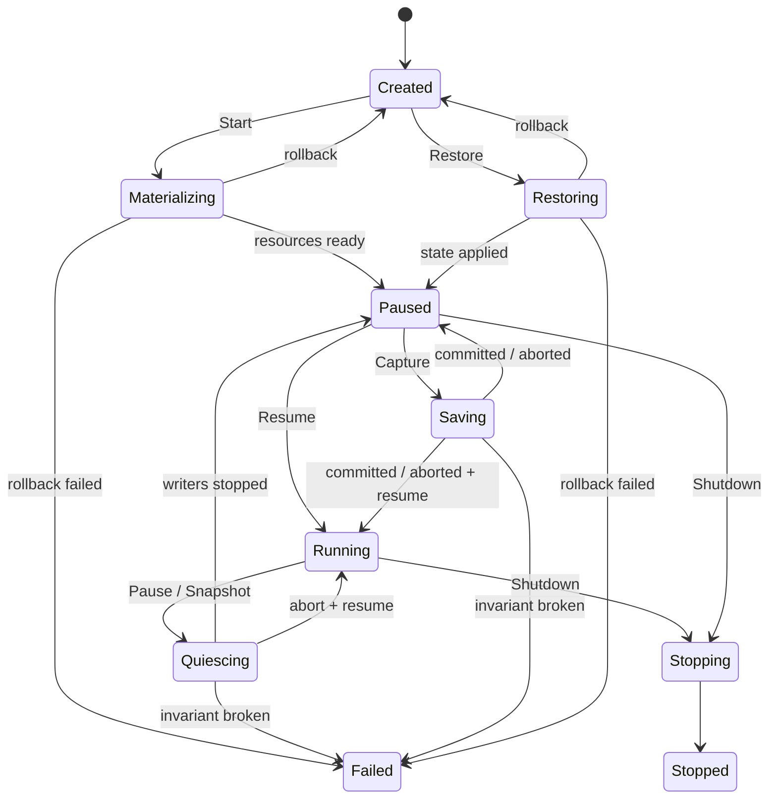

状态转换由 reducer 决定；runtime 只执行 effect。`Failed` 仅表示一致性无法保证。

## 内存与 KVM

```rust
struct MachineMemory {
    ram: GuestMemoryMmap,
    device_regions: HashMap<DeviceId, DeviceMemoryRegion>,
    slots: KvmSlotAllocator,
}

struct DeviceMemoryRegion {
    guest_range: GuestRange,
    host_mapping: MmapRegion,
    kvm_slot: u32,
    kind: DeviceMemoryKind,
}

enum DeviceMemoryKind {
    VirtioSharedMemory,
    DaxWindow,
}

enum MemoryBacking {
    Anonymous,
    File { fd: Arc<OwnedFd>, offset: u64 },
}

struct KvmVm {
    fd: VmFd,
    memory: Arc<MachineMemory>,
}
```

```text
RAM
├─ KvmVm       KVM_SET_USER_MEMORY_REGION
├─ VFIO        VFIO_IOMMU_MAP_DMA / iommufd
└─ vhost-user  VHOST_USER_SET_MEM_TABLE + backing fd

device region
└─ KvmVm + owning transport/device
```

普通 RAM 与设备共享窗口分开管理。中央内存管理器分配 GPA 和 KVM slot；设备负责窗口内容和协议。匿名 RAM 不适合 vhost-user，后者通常要求 memfd/shmem/hugetlb。

## vCPU

```rust
struct VcpuManager {
    handles: Vec<VcpuHandle>,
    exits: Receiver<VcpuExit>,
}

// vcpu-N thread 独占
struct VcpuRunner {
    id: VcpuId,
    fd: VcpuFd,
    address_space: Arc<AddressSpace>,
    exits: Sender<VcpuExit>,
}

// vmm-main 持有
struct VcpuHandle {
    control_fd: VcpuFd,
    thread: JoinHandle<()>,
}
```

- 每个 vCPU 一个 OS thread，不进入 Tokio runtime。
- MMIO/PIO exit 在 vCPU thread 同步处理。
- 退出原因经 typed channel 发给 `vmm-main`。
- 停止使用 `immediate_exit + directed signal + join`。

## 地址空间与中断

```rust
struct AddressSpace {
    pio: Bus,
    mmio: Bus,
}

struct InterruptManager {
    routes: HashMap<IrqId, InterruptRoute>,
    gsi_allocator: GsiAllocator,
}
```

Bus 保存同步访问的 transport/config model：

```text
vcpu thread -> AddressSpace -> Arc<Mutex<Transport>>
```

`InterruptManager` 分配 GSI，管理 IRQ routing、irqfd、MSI/MSI-X 和 INTx。设备只持有 interrupt source。

## 设备管理

```rust
struct DeviceManager {
    devices: HashMap<DeviceId, AttachedDevice>,
    tasks: LocalTaskSet,
    resources: ResourceManager,
}

enum AttachedDevice {
    Emulated(EmulatedVirtio),
    VhostUser(VhostUserDevice),
    Vfio(VfioDevice),
}
```

`LocalTaskSet` 仅管理 `vmm-main` 上的任务，不代表设备拓扑。

### 进程内异步设备

```text
guest notify -> KVM_IOEVENTFD -> AsyncEventFd
             -> local backend task -> used ring -> irqfd -> guest
```

- transport：vCPU thread 同步访问。
- backend：`vmm-main` 上的 local async task。

### vhost-user

```text
guest notify -> KVM_IOEVENTFD -> kickfd -> external backend
external backend -> callfd -> KVM_IRQFD -> guest
```

`vmm-main` 只处理连接、协议、内存表、vring、reset 和异常；数据面在外部进程。

### virtio-fs DAX

DAX 是设备共享内存窗口，不是普通 RAM，也不是独立设备：

```rust
struct DaxWindow {
    region: DeviceMemoryRegion,
    writable: bool,
    mappings: BTreeMap<u64, DaxMapping>,
}

struct DaxMapping {
    window_offset: u64,
    length: u64,
    file_offset: u64,
}
```

```text
ResourceManager 分配 GPA + KVM slot
-> 预留 PROT_NONE / MAP_NORESERVE host window
-> KVM 注册整个 window
-> transport 暴露 virtio shared-memory region

FUSE_SETUPMAPPING / vhost-user FS_MAP
-> 在 window 内 MAP_FIXED 文件区间
FUSE_REMOVEMAPPING / FS_UNMAP
-> 恢复为 PROT_NONE 匿名映射
```

- 进程内 virtio-fs 由 local backend task 提交 map/unmap。
- vhost-user-fs 通过 backend-request channel 提交 `FS_MAP/FS_UNMAP`；普通 RAM 仍走 `SET_MEM_TABLE`。
- map/unmap 在 `vmm-main` 串行执行，设备不能自行分配 GPA 或 KVM slot。
- 默认只读；可写 DAX 必须显式启用并约束文件一致性与安全策略。
- DAX window 不自动加入无关 VFIO 设备的 DMA domain。
- teardown 先停止 backend，再清除映射、注销 KVM slot、释放窗口。
- snapshot 保存映射元数据或重建窗口，不直接把整个 DAX window 当 RAM dump。

### VFIO 直通

```text
guest BAR -> BAR mmap / trapped config access
guest DMA -> IOMMU mapping -> hardware
hardware IRQ -> VFIO eventfd -> KVM_IRQFD -> guest
```

VFIO 通常没有 async backend task；`vmm-main` 只处理 hotplug、错误、reset、迁移和不可 mmap 的 BAR。

## 统一事件入口

```rust
enum MachineEvent {
    VcpuExit { id: VcpuId, reason: VcpuExit },
    DeviceStopped { id: DeviceId },
    DeviceFailed { id: DeviceId, error: String },
    VhostUserDisconnected { id: DeviceId },
    VfioError { id: DeviceId, error: String },
}
```

```rust
select! {
    request = server.next() => ...,
    event = machine.events.next(), if machine.is_some() => ...,
}
```

## 函数式分层

采用 **functional core / imperative shell**，不强行把 KVM、线程或设备 I/O 写成纯函数。

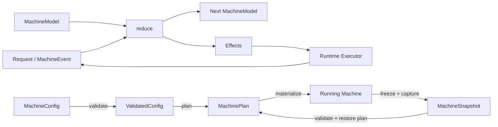

```rust
struct Transition {
    next: MachineModel,
    effects: Vec<Effect>,
}

enum MachineInput {
    Command(MachineCommand),
    Event(MachineEvent),
}

fn validate(config: MachineConfig, caps: &HostCapabilities)
    -> Result<ValidatedMachineConfig>;

fn plan(config: &ValidatedMachineConfig, inventory: &ResourceInventory)
    -> Result<MachinePlan>;

fn reduce(model: &MachineModel, input: MachineInput)
    -> Result<Transition>;

fn query_status(model: &MachineModel) -> VmmStatus;
```

`Effect` 描述副作用，不保存运行时对象：

```rust
enum Effect {
    StartVcpus,
    StopVcpus,
    AttachDevice(DevicePlan),
    QuiesceDevices,
    RegisterIrq(IrqPlan),
    MapDax(DaxMapPlan),
    ChangeVfioMigrationState(VfioMigrationState),
}
```

规则：

- `run_vmm` 从 `VmmRequest` 拆出 typed reply，并在栈上按 `OperationId` 保存；reply 不进入 model、reducer 或 snapshot。
- 查询直接使用纯函数；命令 reply 等待对应 effect 的 completion event。
- `run_vmm` 返回前必须完成或失败所有 pending reply。
- 配置验证、资源布局、状态转换尽量纯函数化。
- ioctl、fd、mmap、线程、socket、task 只存在于 executor/runtime。
- `DeviceId`、GPA、BAR、GSI、KVM slot 等布局一旦运行即稳定。
- 数据面不经过 reducer；virtqueue、DMA、DAX fault 等走各自快速路径。
- 执行 effect 失败时产生新事件，由 reducer 决定回滚、停止或降级。

## 保存与恢复模型

Snapshot 是版本化的纯数据，不序列化 `Arc`、fd、裸指针、mmap 地址、线程或 task。

```rust
struct MachineSnapshot {
    manifest: SnapshotManifest,
    model: MachineModel,
    memory: MemorySnapshot,
    vm: KvmVmState,
    vcpus: Vec<VcpuState>,
    devices: BTreeMap<DeviceId, DeviceSnapshot>,
}

struct SnapshotManifest {
    format_version: u32,
    architecture: Architecture,
    required_capabilities: CapabilitySet,
    topology_hash: Digest,
}

enum DeviceSnapshot {
    Emulated(EmulatedDeviceState),
    VhostUser(VhostUserState),
    Vfio(VfioMigrationState),
}
```

| 组件            | 保存内容                                                    | 不保存                   |
| --------------- | ----------------------------------------------------------- | ------------------------ |
| `MachineModel`  | 状态、配置、稳定拓扑和资源布局                              | runtime handle           |
| RAM             | region 元数据、全量页或 dirty pages                         | 当前 HVA                 |
| KVM VM          | clock、irqchip、PIT、路由状态                               | `VmFd`                   |
| vCPU            | regs、sregs、MSR、LAPIC、events、MP state                   | `VcpuFd` / thread        |
| emulated device | feature、config、queue index、backend state                 | eventfd / task           |
| vhost-user      | negotiated feature、vring、inflight/backend migration state | socket / kickfd / callfd |
| VFIO            | VFIO migration blob 与兼容性标识                            | device fd / DMA mapping  |
| DAX             | window 布局、mapping 元数据或重建策略                       | window 页面 dump / HVA   |

```text
SnapshotBundle
├─ manifest
│  ├─ format / architecture / capability requirements
│  ├─ section versions, sizes and checksums
│  └─ parent snapshot digest                  [diff only]
├─ machine-model
│  └─ config / topology / resource layout
├─ memory
│  ├─ region table
│  ├─ dirty bitmap                           [diff only]
│  └─ page chunks
├─ kvm-vm
│  └─ clock / irqchip / PIT / routes
├─ vcpus
│  └─ stable VcpuId -> VcpuState
└─ devices
   └─ stable DeviceId -> versioned DeviceSnapshot
```

格式规则：

- section 独立版本化；未知必需 section 直接拒绝。
- `VcpuState` 保存的 MSR 索引集合属于 `required_capabilities`；目标宿主的 `msr_index_list` 不覆盖它时在验证阶段拒绝，不留给 `KVM_SET_MSRS` 失败。
- snapshot 中的 machine state 规范化为 `Paused`，不保存 `Saving` 等瞬态状态。
- diff snapshot 引用不可变 base digest，不依赖可变文件路径。
- 数据先写临时目标并校验，manifest 最后原子发布。

### Quiesce 与可恢复性

Quiesce 完成表示：不再接受新请求；in-flight I/O 已完成或已序列化；queue index 和 guest memory 不再变化。

| 数据路径         | Quiesce / 保存方式                                    |
| ---------------- | ----------------------------------------------------- |
| emulated backend | task 停在安全点，保存 queue 与 in-flight state        |
| vhost-user       | suspend vring，读取 backend/inflight migration state  |
| VFIO             | 进入设备 migration `STOP_COPY`，读取 migration stream |
| DAX              | 阻止 map/unmap；保存映射元数据或选择空窗口重建        |

- 每个设备声明 `Migratable`、`Restartable` 或 `NonMigratable`。
- vhost-user backend 不支持所需迁移协议时，拒绝在线 snapshot。
- VFIO 仅在设备支持 migration state 且目标设备兼容时恢复。
- diff snapshot 需要 KVM dirty log 以及设备 DMA dirty tracking；能力不足则退回全量。
- DAX window 不作为 RAM dump；可写 backing 变化时拒绝恢复或显式失效映射。
- 大块 RAM 和 migration stream I/O 交给专用 writer/worker，不阻塞 `vmm-main` LocalRuntime。
- restore 先验证 manifest 与宿主能力，再创建任何外部副作用。

## 关键时序

### 创建并启动 VM

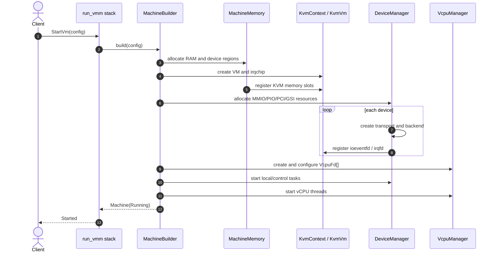

约束：内存和 transport 在 vCPU 启动前就绪；设备数据路径先于 guest 执行建立。

### 主循环调度

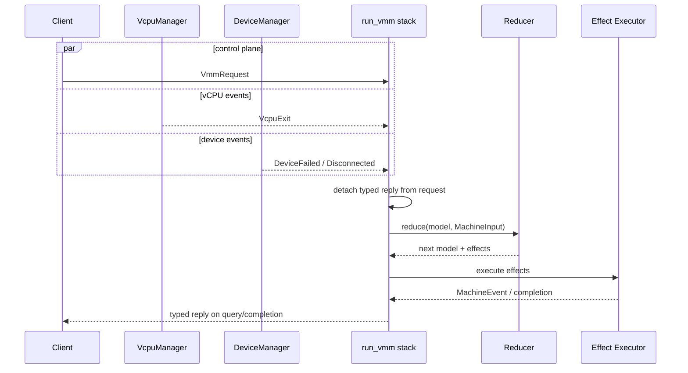

`run_vmm` 只选择输入、维护 pending reply 并提交 effect；状态决策集中在 reducer。

### 进程内异步设备

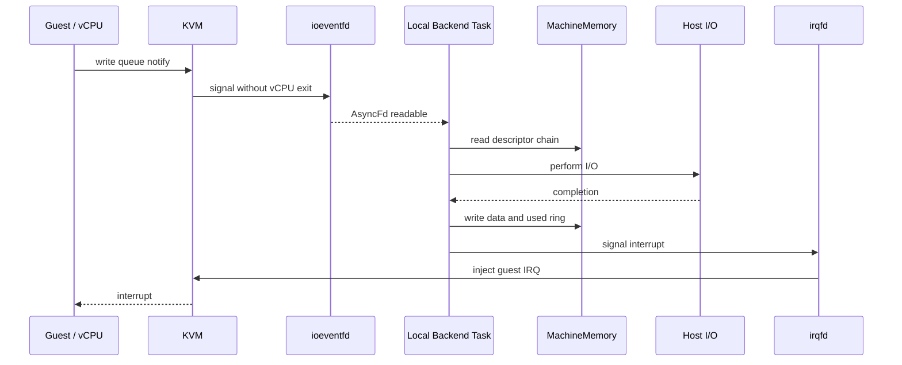

只有 backend task 进入 LocalRuntime；transport/config 仍由 vCPU thread 同步访问。

### vhost-user

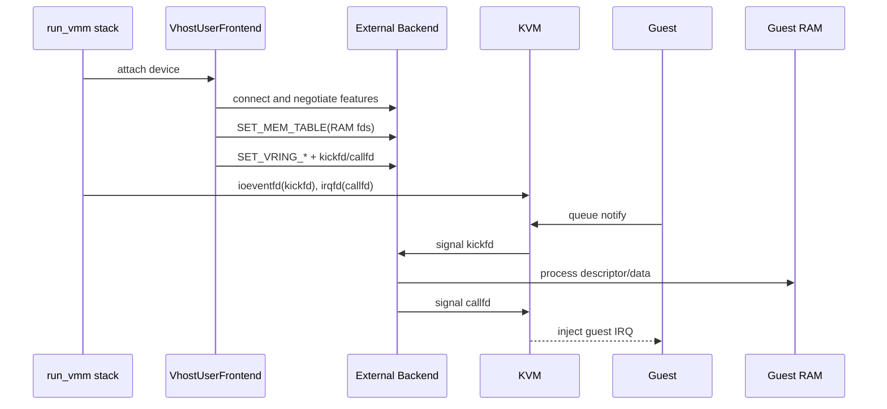

VMM 处理控制面；稳定状态下的数据面不经过 `vmm-main`。

### virtio-fs DAX

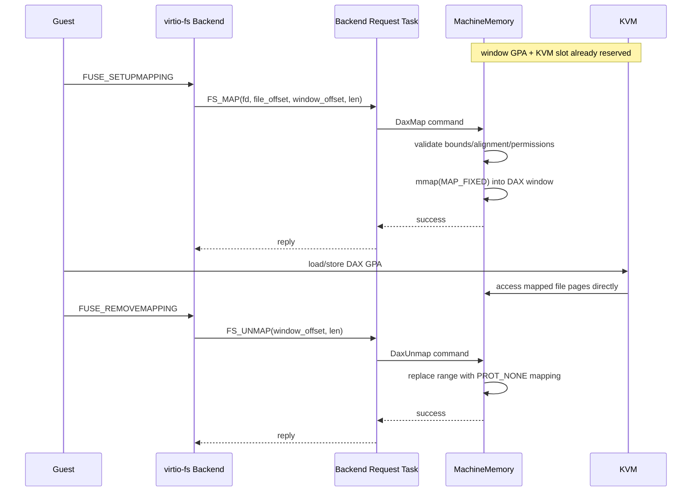

进程内 virtio-fs 可省略 backend-request socket，但仍通过 `MachineMemory` 串行修改窗口。

### VFIO 直通

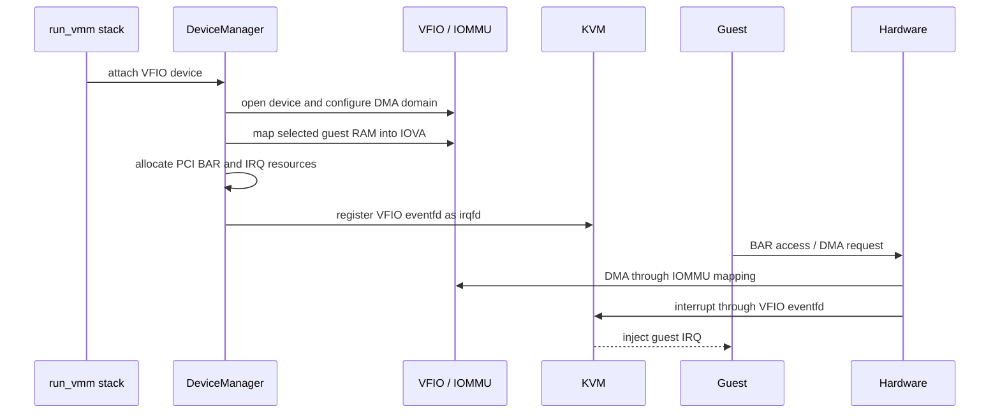

DAX 和其他设备私有窗口默认不加入 VFIO DMA domain。

### 保存 Snapshot

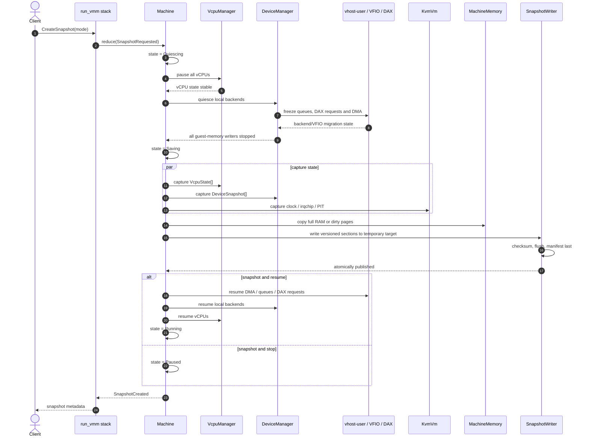

一致性点：vCPU、进程内 backend、vhost-user 和 VFIO 都停止写 guest memory 后，才读取设备状态与 RAM。

### 恢复 Snapshot

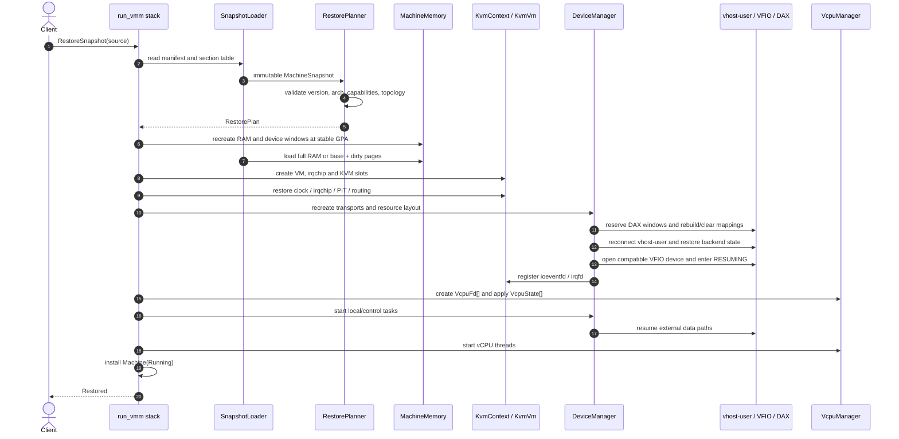

恢复失败时只销毁已 materialize 的 runtime 资源；原始 `MachineSnapshot` 保持不变，可再次规划或恢复。

### 停止 VM

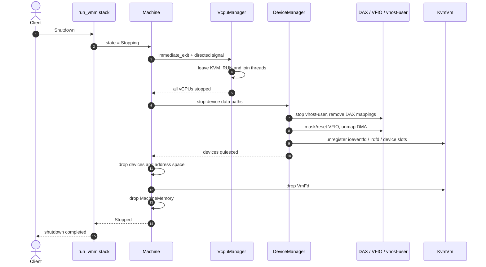

核心顺序：先停止 vCPU，再停止 DMA/设备，最后释放 KVM slot 和内存。

## 当前代码映射

现有代码只覆盖控制面骨架与设备模型，KVM 侧已全部移除，等待按本文重写。

```text
Vmm 的协调字段            -> run_vmm 栈上变量
VmmServer / VmmClient     -> requests: VmmServer
VmmRequest + Reply<T>     -> MachineCommand + typed reply
DeviceManager 的 task 管理 -> LocalTaskSet
BlockDevice / Serial      -> EmulatedVirtio 的 backend task、legacy 设备
```

尚不存在：`KvmContext`、`KvmVm`、`MachineMemory`、`VcpuManager`、`AddressSpace`、`InterruptManager`、reducer/effect 分层、snapshot/restore。参考 Firecracker 亦未实现 DAX，上述内容是目标边界而非现状。

按设计问题展开的系列文章见 [blog/README.md](blog/README.md)。